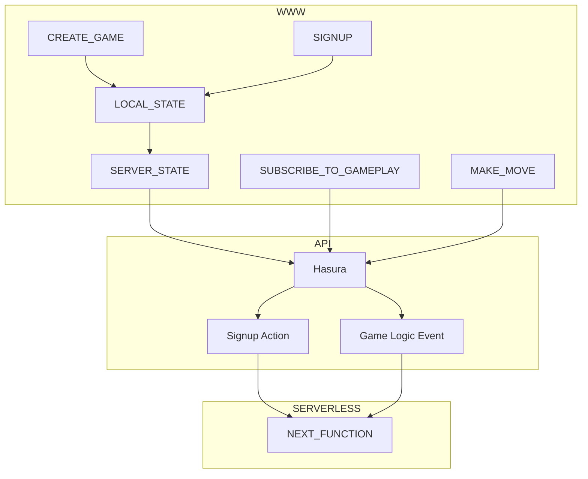
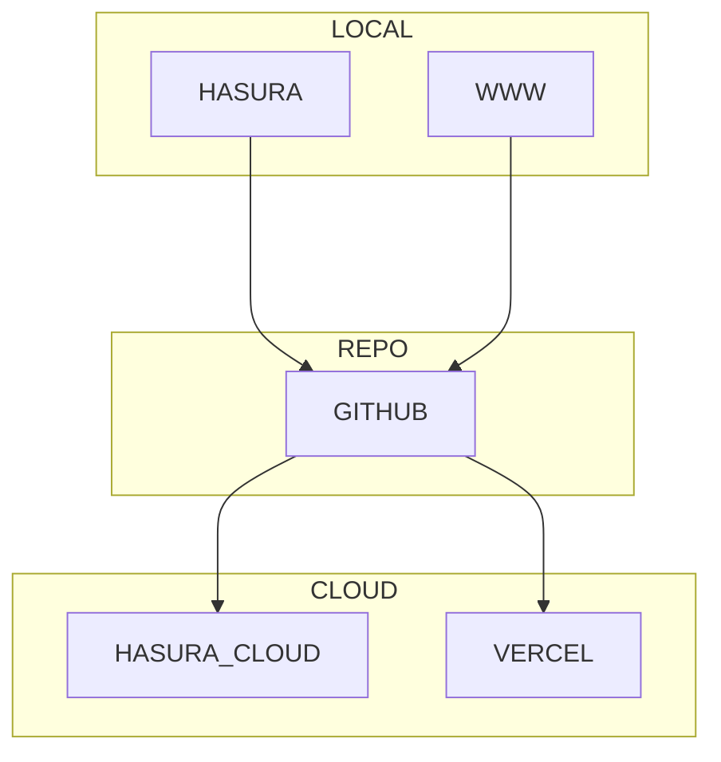
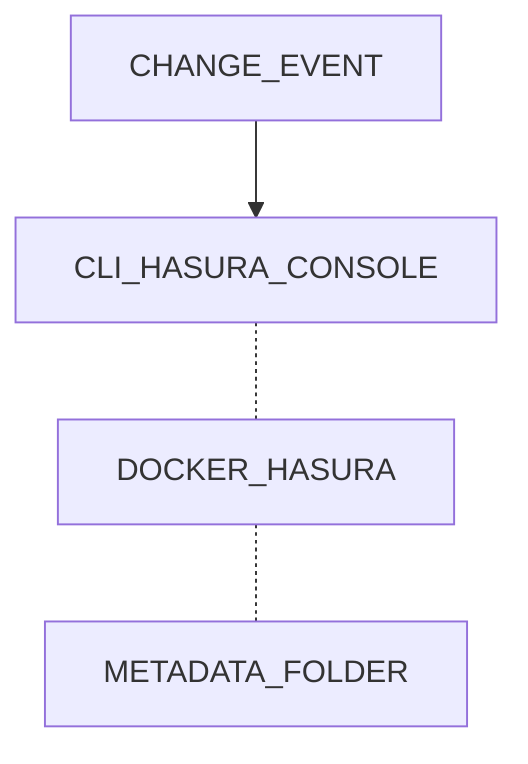

# An opinionated stack with Hasura and React

## What this project is

**This is not:**

- a beginner guide
- …even a best practice guide

**This is:**

- A usable pattern

---

## Architecture

### App

### CI/CD

### Hasura CLI

---

## React parts

- [NextJS](./guide/nextjs.md)

## Front-end parts

- [tailwind](./guide/tailwind.md)
- [urql](./guide/urql.md)
- [zustand](./guide/zustand.md)
- [graphql-codegen](./guide/graphql-codegen.md)

## GraphQL API

- [Hasura](./guide/hasura.md)
- [NextJS](./guide/nextjs.md)

## Postgres

[Schema Reference](./complete/hasura/migrations/Default/1650632011592_init/up.sql)

## Guide

[Start Here](./guide/start.md)
